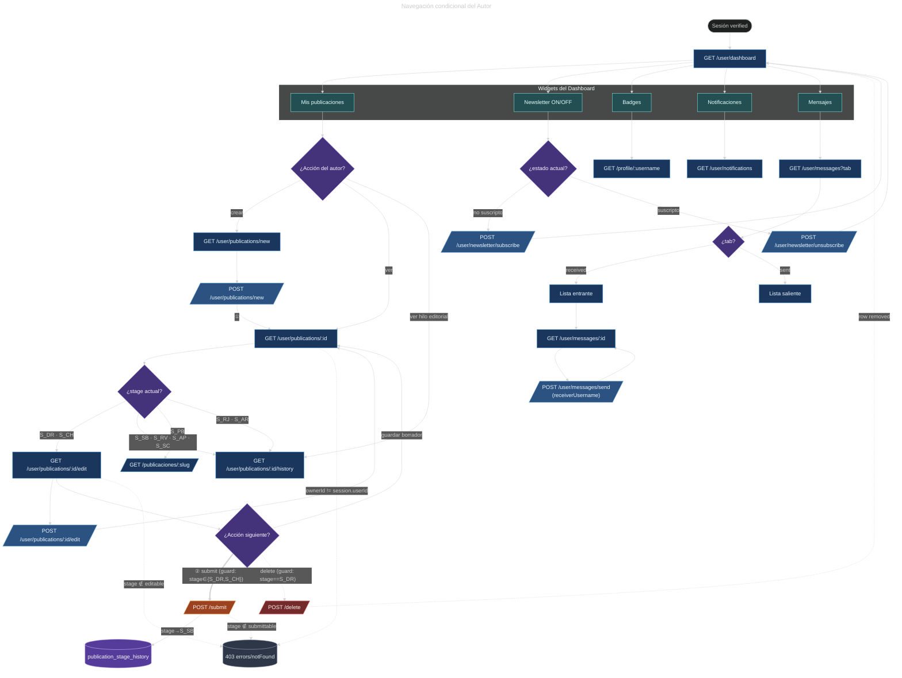
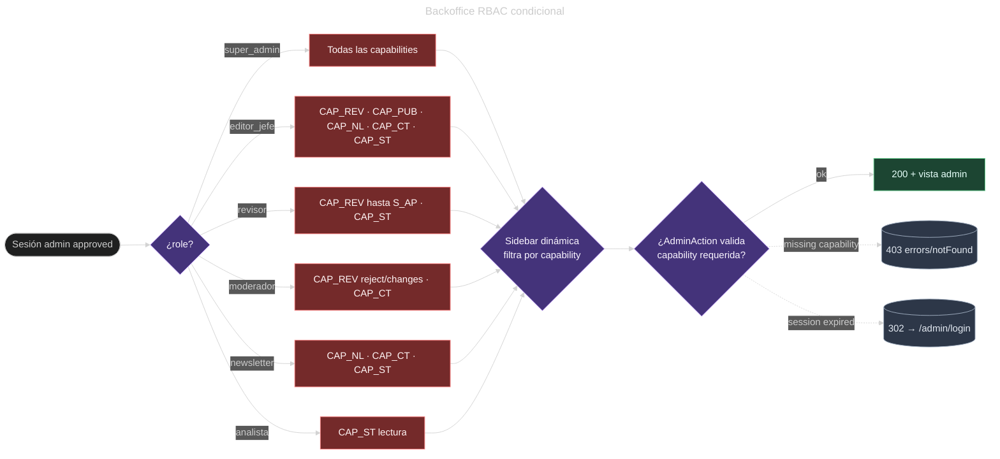
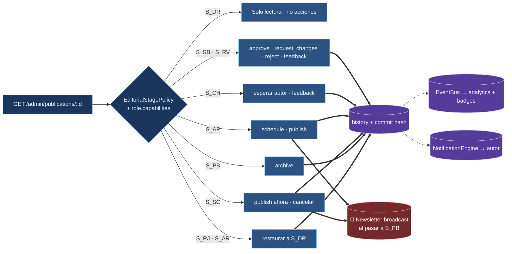

# 🔀 Flujos Condicionales — Usuario & Admin (v2)

Especificación visual del ruteo condicional de la plataforma. Cada diagrama es **auditable**: sus aristas declaran el predicado que activa la transición y sus nodos respetan un **vocabulario gráfico fijo** que indica el tipo de operación y su nivel de riesgo.

> Out of scope: cron jobs, webhooks externos, retries del Circuit Breaker SMTP, errores de red transitorios.

---

## 📖 Leyenda canónica

### Tipos de nodo

| Forma | Significado | Ejemplo |
|-------|-------------|---------|
| `([texto])` | Inicio / Fin del flujo | `([Visita])` |
| `[texto]` | Pantalla renderizada (GET) | `[/user/dashboard]` |
| `{texto}` | Decisión / guard explícito | `{role.has(CAP_PUB)?}` |
| `[/texto/]` | Acción HTTP con efecto (POST/PUT/DELETE) | `[/POST /submit/]` |
| `[(texto)]` | Efecto lateral (engine, repo, broadcast) | `[(NotificationEngine)]` |
| `[[texto]]` | Sub-proceso documentado en otro diagrama | `[[Pipeline editorial]]` |

### Tipos de arista

| Trazo | Semántica |
|-------|-----------|
| `-->` | Navegación HTTP / transición síncrona |
| `==>` | Ask Pattern (request/response a un actor) |
| `-.->` | Tell / Pub-Sub / fire-and-forget |
| `~~~` | Ordenamiento de layout (sin semántica) |

### Color por **riesgo**, no por estética

| Color | Significado | Uso |
|-------|-------------|-----|
| 🟢 verde | Lectura pública / segura | Vistas anónimas, listados |
| 🔵 azul | Escritura autenticada reversible | CRUD del autor, edits de borrador |
| 🟠 naranja | Transición de estado | Submit, approve, schedule |
| 🔴 rojo | Efecto irreversible o broadcast | Publish, delete, newsletter blast |
| 🟣 violeta | Decisión / guard | Rombos de branch |
| ⚫ gris | Error / dead-end | 401, 403, 404, 5xx |

### Numeración del happy path

`①…⑨` sobre las aristas del camino feliz visitante → registro → verificación → publicación → `published`.

---

## 🎭 Actores y guards

| Actor | Predicado de sesión | Capability principal |
|-------|--------------------|----------------------|
| **Visitante** | `!session` | — |
| **Pendiente** | `session.userId && !verified` | — |
| **Autor** | `session.userId && verified` | `OWN_PUBLICATIONS` |
| **Admin** | `session.adminId && approved` | matriz `AdminCapability` |

### Capabilities referenciadas (códigos)

| Código | Capability |
|--------|-----------|
| `CAP_REV` | `review_publications` |
| `CAP_PUB` | `publish_content` |
| `CAP_NL`  | `manage_newsletter` |
| `CAP_CT`  | `manage_contacts` |
| `CAP_ST`  | `view_stats` |
| `CAP_AD`  | `manage_admins` *(super_admin)* |

### Etapas editoriales (códigos)

| Código | Stage |
|--------|-------|
| `S_DR` | `draft` |
| `S_SB` | `submitted` |
| `S_RV` | `in_review` |
| `S_CH` | `changes_requested` |
| `S_AP` | `approved` |
| `S_SC` | `scheduled` |
| `S_PB` | `published` |
| `S_RJ` | `rejected` |
| `S_AR` | `archived` |

> Invariante (trigger SQL `trg_close_previous_stage`): para una `publication_id` solo existe **una** fila con `exited_at IS NULL` en `publication_stage_history`.

---

## 🌊 Diagrama maestro — Flujo global condicional v2.1

```mermaid
---
title: Flujo global condicional v2.1
config:
  theme: dark
  flowchart:
    curve: basis
    nodeSpacing: 55
    rankSpacing: 70
---
flowchart TD
    START([Visita la app]) --> GATE{¿session cookie?}

    %% ════════════════════════════════
    %% SWIMLANE 1 — ACCESO PÚBLICO
    %% ════════════════════════════════
    subgraph PUBLIC["🟢 Capa Pública  (sin sesión)"]
        direction TB
        PHOME["GET /<br/>index"]
        PLIST["GET /publicaciones"]
        PART["GET /publicaciones/:slug"]
        PLEG["GET /privacidad · /terminos"]
        PNL[/"POST /newsletter/subscribe"/]
        PCT[/"POST /contact"/]
    end

    %% ════════════════════════════════
    %% SWIMLANE 2 — IDENTIDAD
    %% ════════════════════════════════
    subgraph IDENTITY["🟠 Capa de Identidad"]
        direction TB
        LOGIN["GET /login"]
        REG["GET /register"]
        REG_P[/"POST /register"/]
        LOGIN_P[/"POST /login"/]
        VERIFY["GET /verify-email/:id"]
        VER_P[/"POST /verify-email"/]
        RESEND[/"GET /resend-code/:id"/]
    end

    %% ════════════════════════════════
    %% SWIMLANE 3 — DOMINIO AUTOR
    %% ════════════════════════════════
    subgraph AUTHOR["🔵 Espacio del Autor  (verified)"]
        direction TB
        UDASH["GET /user/dashboard"]
        UFLOW[["📘 Ver FLOW-USER<br/>(navegación detallada)"]]
    end

    %% ════════════════════════════════
    %% SWIMLANE 4 — DOMINIO ADMIN
    %% ════════════════════════════════
    subgraph ADMIN["🔴 Backoffice  (RBAC)"]
        direction TB
        ADASH["GET /admin/dashboard"]
        ARBAC{¿role.hasAny&#40;CAP_*&#41;?}
        APIPE["GET /admin/publications/pending"]
        AREVIEW["GET /admin/publications/:id"]
        ATRANS{¿stage permite acción<br/>&& role.has&#40;cap&#41;?}
    end

    %% ════════════════════════════════
    %% SWIMLANE 5 — EFECTOS
    %% ════════════════════════════════
    subgraph SIDE["🟣 Efectos del sistema reactivo"]
        direction TB
        NE[("NotificationEngine<br/>⚡ Circuit Breaker")]
        EB[("EventBusEngine<br/>Pub/Sub")]
        NL_BC[("Newsletter Broadcast<br/>→ N suscriptores")]
        REPO[("publication_stage_history<br/>+ commit hash")]
    end

    %% ════════════════════════════════
    %% SWIMLANE 6 — ERRORES
    %% ════════════════════════════════
    subgraph ERRORS["⚫ Caminos negativos"]
        direction TB
        E401["302 → /login"]
        E403["403 / errors/notFound"]
        E404["404 errors/notFound"]
        E500["500 errors/serverError"]
    end

    %% ──── Routing principal ────
    GATE -->|"no"| PHOME
    GATE -->|"session.user && !verified"| VERIFY
    GATE -->|"② session.user && verified"| UDASH
    GATE -->|"session.admin && approved"| ADASH
    GATE -.->|"session inválida o expirada"| E401

    %% ──── Pública ────
    PHOME --> PLIST & PART & PLEG
    PHOME --> PNL & PCT
    PHOME --> LOGIN & REG

    %% ──── Identidad ────
    REG --> REG_P
    REG_P -->|"①"| VERIFY
    VERIFY --> VER_P
    VERIFY --> RESEND
    VER_P -->|"② code.valid && !expired"| UDASH
    VER_P -.->|"code.invalid || expired"| VERIFY
    LOGIN --> LOGIN_P
    LOGIN_P -->|"user"| UDASH
    LOGIN_P -->|"admin"| ADASH
    LOGIN_P -.->|"credentials.invalid"| E401

    %% ──── Autor ────
    UDASH --> UFLOW

    %% ──── Admin ────
    ADASH --> ARBAC
    ARBAC -->|"③ CAP_REV"| APIPE
    ARBAC -.->|"!any capability"| E403
    APIPE --> AREVIEW
    AREVIEW --> ATRANS

    ATRANS ==>|"④ approve / request_changes / reject"| REPO
    ATRANS ==>|"⑤ publish (stage→S_PB)"| REPO
    ATRANS -. "guard fails" .-> E403

    %% ──── Efectos ────
    REPO -.->|"domain event"| EB
    REPO -.->|"notify author"| NE
    REPO ==>|"⑥ if stage==S_PB"| NL_BC
    NL_BC -.-> NE
    NL_BC -.->|"⑦ N rows"| EB

    %% ──── Notas / invariantes ────
    NOTE1["⚠ Invariante:<br/>1 sola etapa abierta<br/>por publication&#95;id<br/>(trigger SQL)"]
    REPO ~~~ NOTE1

    %% ──── Estilos por riesgo ────
    classDef safe fill:#1c4532,stroke:#68d391,color:#e6fffa
    classDef write fill:#1a365d,stroke:#63b3ed,color:#ebf8ff
    classDef transition fill:#9c4221,stroke:#f6ad55,color:#fffaf0
    classDef irreversible fill:#742a2a,stroke:#fc8181,color:#fff5f5
    classDef decision fill:#44337a,stroke:#b794f4,color:#faf5ff
    classDef effect fill:#553c9a,stroke:#d6bcfa,color:#faf5ff
    classDef error fill:#2d3748,stroke:#a0aec0,color:#e2e8f0
    classDef note fill:#2d3748,stroke:#f6e05e,color:#fefcbf,stroke-dasharray: 4 2

    class PHOME,PLIST,PART,PLEG safe
    class PNL,PCT,LOGIN,REG,VERIFY,RESEND write
    class REG_P,LOGIN_P,VER_P transition
    class UDASH,UFLOW write
    class ADASH,APIPE,AREVIEW write
    class GATE,ARBAC,ATRANS decision
    class REPO,NE,EB effect
    class NL_BC irreversible
    class E401,E403,E404,E500 error
    class NOTE1 note

    %% ──── Hipervínculos a sub-flujos ────
    click UFLOW "FLOW-USER.md" "Navegación detallada del autor"
    click AREVIEW "README.md#-pipeline-editorial-9-etapas" "Pipeline editorial"
```

### Lectura del happy path (① → ⑦)

| # | Acción | Predicado | Efecto |
|---|--------|-----------|--------|
| ① | Registro completado | `email.unique && pwd.valid` | Crea `users` row + envía código (NotificationEngine) |
| ② | Verificación / login OK | `code.valid && !expired` | Setea cookie y redirige al dashboard |
| ③ | Admin elige bandeja | `role.has(CAP_REV)` | Lista publicaciones pendientes |
| ④ | Transición intermedia | `stage ∈ {S_SB, S_RV} && role.has(cap)` | Inserta history + cierra etapa anterior + commit hash |
| ⑤ | Publicación final | `stage == S_AP || S_SC` | Marca `S_PB` |
| ⑥ | Broadcast newsletter | `target == S_PB` | Inserta N filas en `user_notifications` |
| ⑦ | Domain event | siempre | EventBus → analytics + badges |

---

## 🧑 Diagrama del Autor — Navegación detallada

### Reglas de negocio condicionales del autor

| Decisión | Predicado completo | Resultado si falla |
|----------|-------------------|---------------------|
| Editar publicación | `pub.ownerId == session.userId && stage ∈ {S_DR, S_CH}` | Redirect a `viewPublication` con flash error |
| Submit a revisión | `stage ∈ {S_DR, S_CH} && pub.title.nonEmpty && pub.contentMarkdown.length ≥ 200` | Mantener en form con errors |
| Borrar publicación | `stage == S_DR && pub.ownerId == session.userId` | 403 |
| Ver hilo editorial | `pub.ownerId == session.userId` | 403 |
| Responder mensaje | `msg.receiverId == session.userId` | 403 |
| Suscribir newsletter | `!subscribed(email)` | Toggle idempotente |

### Visibilidad por etapa en el dashboard

| Stage | Badge mostrado | Acciones del autor disponibles |
|-------|----------------|-------------------------------|
| `S_DR` 📝 | gris | edit, submit, delete |
| `S_SB` 📤 | naranja | view, history |
| `S_RV` 🔍 | azul | view, history |
| `S_CH` ⚠️ | amarillo | edit, submit, history (con feedback) |
| `S_AP` ✅ | verde claro | view, history |
| `S_SC` ⏰ | violeta | view, history |
| `S_PB` 🌐 | verde fuerte | view público, history, share |
| `S_RJ` ❌ | rojo | history |
| `S_AR` 📦 | grafito | history |

---

## 🛡️ Diagrama del Admin — RBAC condicional

### Decisión por etapa editorial (admin)

---

## 📬 Efectos colaterales por transición (matriz completa)

| Transición | Notification (in-app) | Notification (email) | EventBus topic | Newsletter | Badges |
|-----------|----------------------|---------------------|----------------|-----------|--------|
| `→ S_SB` | autor: "Recibida" | ⚡ CB-protected | `publication.submitted` | — | `first_submission` |
| `→ S_RV` | autor: "En revisión" | — | `review.started` | — | — |
| `→ S_CH` | autor: feedback | ⚡ CB-protected | `review.changes_requested` | — | — |
| `→ S_AP` | autor: "Aprobada" | ⚡ CB-protected | `review.approved` | — | `first_approved` |
| `→ S_SC` | autor: fecha | — | `publication.scheduled` | — | — |
| `→ S_PB` 🔴 | autor: "Publicada" | ⚡ CB-protected | `publication.published` | **broadcast → N** | `published_x10` |
| `→ S_RJ` | autor: motivo | ⚡ CB-protected | `review.rejected` | — | — |
| `→ S_AR` | — | — | `publication.archived` | — | — |

> 🔴 = transición irreversible / con efecto masivo. Confirmar siempre con modal en el UI.

---

## 🧭 Convenciones para nuevos diagramas

1. **Un único título** versionado en el frontmatter YAML.
2. **Máximo 7±2 grupos visibles** por diagrama. Si crece → dividir y enlazar con `click`.
3. Cada **rombo** lleva el predicado completo (no etiqueta genérica).
4. Cada **arista negativa** se dibuja con `-.->` y termina en un nodo `error`.
5. Las **invariantes críticas** se documentan como nodo `note` adyacente.
6. El **happy path** se numera `①②③…` para guiar la lectura.
7. **Color por riesgo**, nunca por gusto. La paleta es contractual.
8. **`subgraph` = swimlane**: agrupa por capa o por actor, no por afinidad visual.
9. **Sub-procesos** se referencian con `[[texto]]` y se enlazan vía `click NODO "ARCHIVO.md"`.
10. **Out of scope** declarado al inicio del documento.

---

<strong>Cada vista responde al estado · Cada acción respeta la capability · Cada transición deja huella</strong>

