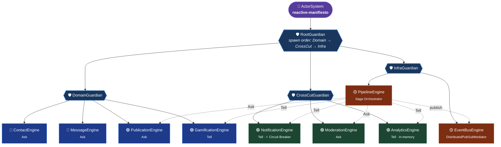
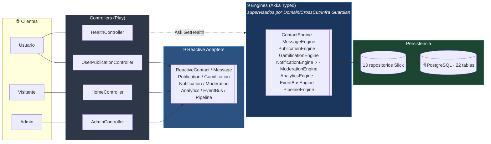
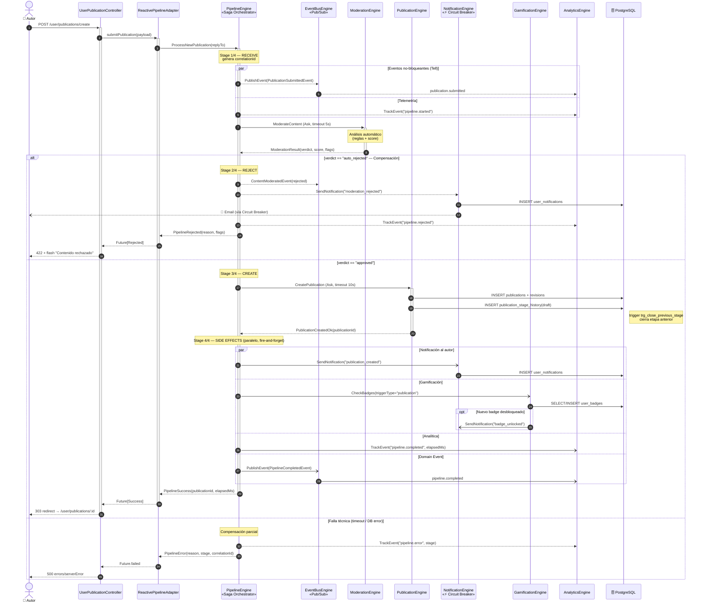
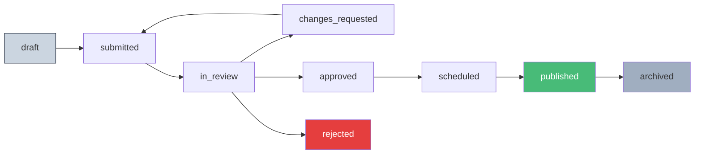
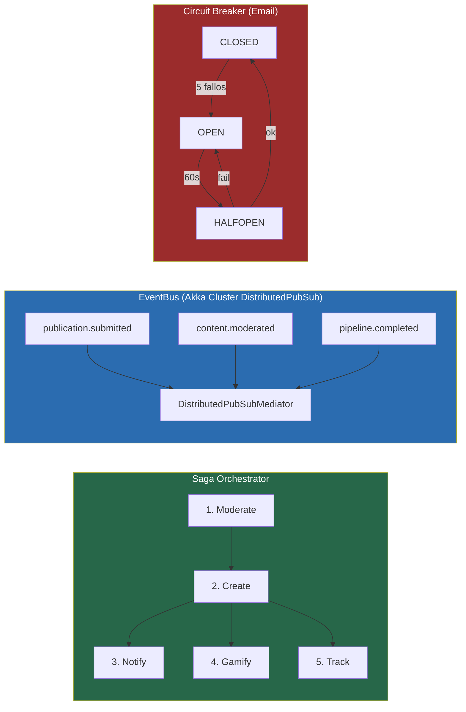

# ⚡ Reactive Manifesto

Plataforma editorial reactiva que aplica los principios del [Reactive Manifesto](https://www.reactivemanifesto.org/) sobre **Play Framework**, **Akka Typed**, **Slick** y **PostgreSQL**.

Combina un sitio público de publicaciones, un espacio de autor con trazabilidad completa y un backoffice editorial con RBAC, pipeline de revisión, mensajería interna y newsletter.

---

## 🛠️ Stack

| Capa | Tecnología |
|------|-----------|
| Backend | Play Framework 3.0.1 |
| Lenguaje | Scala 2.13.12 |
| Sistema reactivo | Akka Typed 2.8.5 |
| Distribución | Akka Cluster + DistributedPubSub 2.8.5 (`eventbus-core`) |
| Serialización inter-nodo | Akka Jackson 2.8.5 |
| Persistencia | Slick 3 + PostgreSQL (H2 en dev) |
| Frontend | Twirl + SCSS (sbt-sassify) + Vanilla JS |
| DI | Guice |
| Build | SBT 1.9.7 |
| Email | JavaMail SMTP + Circuit Breaker |
| Tests | ScalaTestPlus Play 7 + Akka Actor TestKit Typed 2.8.5 |

---

## 🚀 Inicio rápido

```bash
git clone https://github.com/federicopfund/Reactive-Manifesto.git
cd Reactive-Manifesto
sbt run
```

Disponible en **http://localhost:9000**.

```bash
# Limpiar puerto + ciclo completo
fuser -k 9000/tcp 2>/dev/null && sbt clean compile run
```

```bash
# Compilar y empaquetar assets (SCSS → main.css)
sbt webStage
```

```bash
# Ejecutar la suite de tests (5/5)
sbt test

# Solo el smoke test de Cluster Pub/Sub
sbt "testOnly core.EventBusEngineClusterSpec"

# Solo el spec del DomainGuardian
sbt "testOnly core.guardian.DomainGuardianSpec"
```

---

## 📚 Documentación editorial

- [Cadencia editorial y decisión de producto](docs/EDITORIAL_CADENCE.md) — **fuente de verdad** sobre flujo continuo por temporadas, cadencia mensual y pieza inaugural.

---

## 🧭 Mapa funcional

| Área | Rutas | Vistas | Roles |
|------|-------|--------|-------|
| **Público** | `/`, `/publicaciones`, `/portafolio`, `/articles/:slug` | `index`, `publicaciones`, `editorialArticleView` | anónimo |
| **Autenticación** | `/login`, `/register`, `/verify-email` | `auth/*` | anónimo |
| **Espacio de autor** | `/user/dashboard`, `/user/publications/*`, `/user/inbox`, `/user/bookmarks`, `/user/notifications` | `user/*` | autenticado |
| **Backoffice editorial** | `/admin/*` | `admin/*` | `super_admin`, `editor_jefe`, `revisor`, `moderador`, `newsletter`, `analista` |
| **Errores** | — | `errors/notFound`, `errors/serverError` | global |

---

## 🏗️ Arquitectura de Agentes

**1 `ActorSystem` raíz** (`reactive-manifiesto`) con un `RootGuardian` que supervisa **3 guardians especializados**, los cuales a su vez levantan los **9 agentes** del sistema con _backoff supervision_. La comunicación inter-agente se realiza por el **EventBus distribuido** (Akka Cluster DistributedPubSub) y un **Saga Orchestrator** (`PipelineEngine`).

```
reactive-manifiesto (ActorSystem)
└── RootGuardian
    ├── DomainGuardian      → Contact · Message · Publication · Gamification
    ├── CrossCutGuardian    → Notification · Moderation · Analytics
    └── InfraGuardian       → EventBus (Cluster Pub/Sub) · PublicationPipeline
```

Cada guardian aplica `SupervisorStrategy.restartWithBackoff(minBackoff = 200ms, maxBackoff = 10s, randomFactor = 0.2)` sobre sus hijos.

### Jerarquía de supervisión

Vista centrada en el árbol de actores: **`RootGuardian` → 3 guardians → 9 agentes**. Las flechas sólidas representan relaciones de **supervisión** (padre → hijo, con backoff supervision).



> Líneas sólidas = supervisión (padre → hijo) · Líneas punteadas = mensajes lógicos del Saga (Ask/Tell/publish).

### Flujo de invocación HTTP → Adapter → Agente

Visión complementaria: cómo entra una request HTTP al sistema reactivo. Los `Reactive*Adapter` resuelven el `ActorRef` del agente correspondiente vía Ask al guardián padre, **manteniendo la jerarquía** anterior.



### Los 9 agentes (agrupados por guardian)

| # | Agente | Guardian | Patrón | Responsabilidad |
|---|--------|----------|--------|-----------------|
| 🔵 | ContactEngine | `DomainGuardian` | Ask | Formularios de contacto |
| 🔵 | MessageEngine | `DomainGuardian` | Ask | Mensajería privada + notificación al receptor |
| 🟢 | PublicationEngine | `DomainGuardian` | Ask | Ciclo de vida de publicaciones |
| 🟢 | GamificationEngine | `DomainGuardian` | Tell | Otorgamiento de badges |
| 🟢 | NotificationEngine | `CrossCutGuardian` | Tell | Hub multicanal con **Circuit Breaker** SMTP |
| 🟢 | ModerationEngine | `CrossCutGuardian` | Ask | Auto-moderación + cola manual |
| 🟢 | AnalyticsEngine | `CrossCutGuardian` | Tell | Métricas en memoria (zero-latency) |
| 🟡 | EventBusEngine | `InfraGuardian` | **Cluster Pub/Sub** | Bus de domain events vía `DistributedPubSubMediator` |
| 🟡 | PipelineEngine | `InfraGuardian` | Saga | Orquesta Moderate → Create → Notify → Gamify → Track |

> 🔵 dominio · 🟢 cross-cutting · 🟡 infraestructura

### EventBus distribuido (Akka Cluster)

El `EventBusEngine` delega el routing en `akka.cluster.pubsub.DistributedPubSubMediator`:

- **Routing O(1) por topic** (antes O(n) con `Map.filter`).
- **Sin SPOF**: la tabla de suscriptores se replica entre los nodos vía gossip.
- **Cluster-ready**: el mismo binario escala horizontalmente sin tocar a los 9 agentes.
- **Topics**: derivados del prefijo de `event.eventType` (`publication.submitted` → `publication`) + topic comodín `"*"`.
- **Configuración aislada**: solo el ActorSystem usa `provider = cluster` (bloque `eventbus-cluster` en `application.conf`); el resto del runtime sigue local.
- **Serialización**: `sealed trait DomainEvent` anotado con `@JsonTypeInfo` + `@JsonSubTypes`, binding `core.DomainEvent = jackson-json`.

### Endpoint de salud

`GET /health` consulta a los 3 guardians y devuelve un JSON consolidado con el estado de cada hijo:

```bash
curl -s http://localhost:9000/health | jq
```

```json
{
  "status": "Healthy",
  "guardians": {
    "domain":   { "contact": "Healthy", "message": "Healthy", "publication": "Healthy", "gamification": "Healthy" },
    "crosscut": { "notification": "Healthy", "moderation": "Healthy", "analytics": "Healthy" },
    "infra":    { "eventBus": "Healthy", "pipeline": "Healthy" }
  }
}
```

---

## � Documentación formal — Diagrama de Secuencia UML

Especificación normativa de la interacción entre agentes durante el caso de uso crítico **«Crear publicación»**, donde el `PipelineEngine` actúa como **Saga Orchestrator** coordinando los 9 agentes del sistema reactivo.

### Convenciones del diagrama

| Notación | Semántica |
|----------|-----------|
| `->>` | Mensaje **síncrono lógico** (`Ask` pattern, con `replyTo` y timeout) |
| `-->>` | Mensaje **fire-and-forget** (`Tell` pattern, no espera respuesta) |
| `-)`   | Mensaje **asíncrono paralelo** (efectos colaterales del Saga) |
| `--)`  | Notificación **externa** (email saliente vía SMTP) |
| `alt / else` | Bifurcación lógica del Saga (resultado de moderación) |
| `par / and` | Ejecución **concurrente** de side-effects (no-bloqueante) |
| `opt` | Rama opcional condicional |
| `Note over` | Invariante, etapa del Saga o restricción de dominio |

### Caso de uso: `ProcessNewPublication`



### Trazabilidad de mensajes

| # | Mensaje | Tipo | Origen → Destino | Garantía |
|---|---------|------|------------------|----------|
| 3 | `ProcessNewPublication` | Ask | Adapter → Pipeline | At-most-once, timeout 30s |
| 7 | `ModerateContent` | Ask | Pipeline → Moderation | At-most-once, timeout 5s |
| 8 | `ModerationResult` | Reply | Moderation → Pipeline | Vía `messageAdapter` (tipado) |
| — | `PublishEvent(*)` | Tell | Pipeline → EventBus | At-most-once, fan-out Pub/Sub |
| — | `CreatePublication` | Ask | Pipeline → Publication | At-most-once, timeout 10s |
| — | `SendNotification` | Tell | Pipeline → Notification | At-most-once + Circuit Breaker |
| — | `CheckBadges` | Tell | Pipeline → Gamification | At-most-once, fire-and-forget |
| — | `TrackEvent` | Tell | Pipeline → Analytics | At-most-once, en-memoria |

### Garantías reactivas verificadas en el flujo

| Principio | Evidencia en el diagrama |
|-----------|--------------------------|
| **Responsive** | Todo `Ask` lleva timeout explícito; `replyTo` resuelve el `Future` del controller sin bloquear hilos |
| **Resilient** | Compensación en rama `auto_rejected`; `NotificationEngine` aislado por Circuit Breaker; falla en gamificación/analytics no aborta el Saga |
| **Elastic** | Bloque `par` ejecuta side-effects concurrentes; cada `correlationId` permite N pipelines simultáneos sin estado compartido |
| **Message-Driven** | Toda interacción es un `Command`/`Event` tipado; cero llamadas síncronas entre agentes |

### Invariantes del Saga

1. **Atomicidad lógica**: si `verdict == auto_rejected`, **no** se persiste `publications` (compensación preventiva).
2. **Trazabilidad**: el `correlationId` (8 chars, generado en Stage 1) viaja en *todos* los eventos, notificaciones y métricas asociadas.
3. **Idempotencia del trigger**: `trg_close_previous_stage` garantiza `exited_at IS NULL` único por publicación incluso bajo concurrencia.
4. **Ordenamiento causal**: `PublicationCreatedOk` siempre **precede** a los side-effects de Stage 4 (garantizado por el `messageAdapter` y el modelo de actores).
5. **No back-pressure perdida**: las respuestas `PipelineSuccess | PipelineRejected | PipelineError` son **mutuamente excluyentes** y exhaustivas (`sealed trait PipelineResponse`).

---

## �📰 Pipeline Editorial (9 etapas)

Cada publicación recorre un workflow gobernado por la tabla `editorial_stages` y un **trigger de PostgreSQL** que mantiene la invariante `exited_at IS NULL` por publicación.



Cada transición:

1. **Genera un commit hash determinista** (`StageCommitHash`, SHA-1 estilo git) que viaja en el historial.
2. **Inserta** en `publication_stage_history` y **cierra** la etapa anterior vía trigger.
3. **Notifica al autor** (in-app + email si está habilitado).
4. **Si llega a `published`**, dispara un **broadcast de newsletter** a `newsletter_subscribers` activos.
5. **Emite un domain event** al EventBus para analítica y badges.

### Trazabilidad para autores

Los autores ven el **hilo completo** de su publicación en `/user/publications/:id/history` con:

- Línea de tiempo de etapas con timestamps y commit hash
- Feedback editorial (sin notas internas)
- Notificaciones recibidas
- Reuso del widget `_publicationPipeline` (con `showInternalNotes = false`)

---

## 🔐 RBAC del Backoffice

6 roles con matriz de capacidades. Cada controlador admin valida `Capability` antes de ejecutar.

| Rol | Pipeline | Publicar | Newsletter | Contactos | Admins | Stats |
|-----|---------|----------|------------|-----------|--------|-------|
| `super_admin` | ✅ | ✅ | ✅ | ✅ | ✅ | ✅ |
| `editor_jefe` | ✅ | ✅ | ✅ | ✅ | — | ✅ |
| `revisor` | ✅ (hasta `approved`) | — | — | — | — | ✅ |
| `moderador` | ✅ (rechazar/cambios) | — | — | ✅ | — | — |
| `newsletter` | — | — | ✅ | ✅ | — | ✅ |
| `analista` | lectura | — | — | — | — | ✅ |

La sidebar (`adminLayout` → `sidebar.scala.html`) se renderiza dinámicamente según `Capability`.

---

## ✉️ Mensajería + 📰 Newsletter

- **Mensajería privada** entre usuarios y entre usuarios ↔ admins. Vistas con composer y estado vacío amigable. Tema dual cream/admin-dark.
- **Newsletter** con suscripción/baja desde el dashboard del usuario; broadcast automático cuando una publicación llega a `published`. Panel admin con KPIs, filtro por email e IP de registro.

### Sistema de estilos (BEM)

| Namespace | Alcance |
|-----------|---------|
| `ed-*` | Front editorial (cream) |
| `ed-bo-*` | Backoffice (admin-dark + acento `#d4ff00`) |
| `ed-msg-*` | Mensajería |
| `ed-nl-*`, `ed-newsletter-card` | Newsletter |
| `ed-thread-*` | Hilo de trazabilidad |
| `ed-cat-*` | Filtros tipo "section nav" |

SCSS modular en `app/assets/stylesheets/components/*.scss`, compilado a `target/web/public/main/main.css`.

---

## 🗄️ Base de Datos

22 tablas gestionadas con evolutions (`conf/evolutions/default`):

```
users · admins · admin_capabilities
publications · publication_categories · publication_revisions
publication_feedback · publication_comments · publication_reactions
editorial_stages · publication_stage_history · editorial_articles
manifesto_pillars
collections · collection_items
user_bookmarks · user_badges · user_notifications
private_messages · newsletter_subscribers · contacts
email_verification_codes · legal_documents
```

> Trigger destacado: `trg_close_previous_stage` mantiene una sola etapa abierta por publicación.

---

## 🧬 Comunicación inter-agente



---

## ✅ Principios Reactivos

| Principio | Implementación |
|-----------|---------------|
| **Responsive** | Non-blocking I/O end-to-end. Timeouts 5–30s en Ask. Fast-fail tipado. `/health` consolidado |
| **Resilient** | Backoff supervision en los 3 guardians. Circuit Breaker SMTP. `pipeToSelf(Failure)`. Compensación en Saga. Cluster Pub/Sub elimina el SPOF del bus |
| **Elastic** | Actor model sin locks. Controllers stateless. Pipeline concurrente. EventBus distribuido vía `DistributedPubSubMediator` (escala añadiendo nodos) |
| **Message-Driven** | `sealed trait *Command`. EventBus Pub/Sub cluster-wide. Domain events con `correlationId` y `@JsonTypeInfo` para serialización inter-nodo |

---

## 📁 Estructura del proyecto

```
Reactive-Manifiesto/
├── app/
│   ├── Module.scala                 # Guice DI: 1 ActorSystem (RootGuardian) + 9 Adapters
│   ├── controllers/                 # HomeController, AuthController, UserPublicationController, AdminController, HealthController, SetupController
│   ├── core/
│   │   ├── *Engine.scala            # 9 Engines (Akka Typed) + DomainEvents
│   │   └── guardian/                # RootGuardian + DomainGuardian + CrossCutGuardian + InfraGuardian + HealthModel
│   ├── services/                    # 9 ReactiveAdapters + EmailService + EmailVerificationService
│   ├── models/                      # case classes + Slick mappings
│   ├── repositories/                # 13 repos async (Slick)
│   ├── utils/                       # StageCommitHash, helpers
│   ├── views/                       # 38 plantillas Twirl (3 layouts + 2 partials + 33 vistas)
│   └── assets/stylesheets/          # SCSS modular (BEM)
├── conf/
│   ├── application.conf             # incluye bloque `eventbus-cluster`
│   ├── routes                       # incluye GET /health
│   ├── messages, messages.en
│   └── evolutions/default/          # Migraciones SQL
├── test/
│   └── core/
│       ├── EventBusEngineClusterSpec.scala   # Issue #14 — DistributedPubSub
│       └── guardian/DomainGuardianSpec.scala # Issue #15 — guardians
├── public/                          # Imágenes, JS, CSS estático
├── sql/                             # Scripts admin (alta de admins, triggers)
├── deploy/                          # Scripts Docker / instalación / email
├── resource/                        # Documentación funcional (.md)
└── build.sbt
```

---

## 🎯 Patrones de diseño

| Patrón | Ubicación |
|--------|-----------|
| Actor Model | `core/*Engine.scala` |
| Hierarchical Supervision | `core/guardian/{Root,Domain,CrossCut,Infra}Guardian.scala` |
| Backoff Supervision | `Behaviors.supervise(...).onFailure(restartWithBackoff(...))` en cada guardian |
| Ask / Tell Pattern | `services/Reactive*Adapter.scala` |
| Saga Orchestrator | `PublicationPipelineEngine` |
| Cluster Pub/Sub | `EventBusEngine` (`DistributedPubSubMediator`) |
| Circuit Breaker | `NotificationEngine` (SMTP) |
| `pipeToSelf` | Todos los Engines |
| Repository | `repositories/*` |
| Adapter | `services/Reactive*Adapter.scala` |
| Command | `sealed trait *Command` |
| Dependency Injection | `Module.scala` (Guice) |
| Health Endpoint | `controllers/HealthController` + `GET /health` |
| MVC | Play estándar |
| Capability-based RBAC | `models/AdminCapability` + `actions/AdminAction` |
| Deterministic hashing | `utils/StageCommitHash` (SHA-1) |
| BEM | `app/assets/stylesheets/components/*.scss` |

---

## 🌐 Internacionalización

Español (default) e inglés vía `conf/messages` y `conf/messages.en`.

---

## 👤 Autor

**Federico Pfund** — [@federicopfund](https://github.com/federicopfund)

## 📄 Licencia

MIT

---

<p align="center"><strong>Responsive · Resilient · Elastic · Message-Driven</strong></p>
