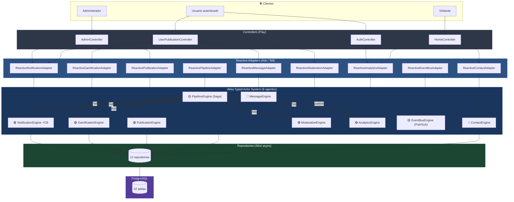
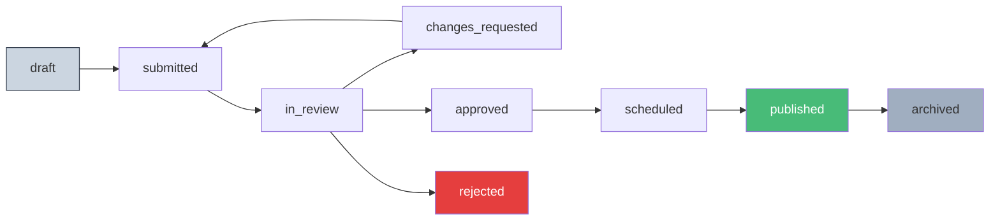
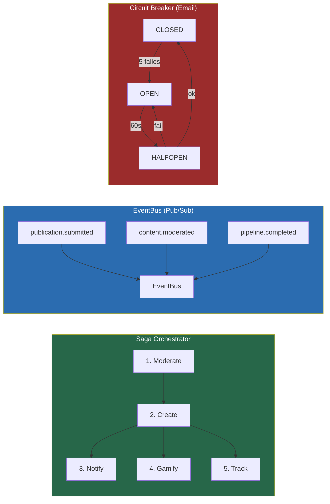

# ⚡ Reactive Manifesto

Plataforma editorial reactiva que aplica los principios del [Reactive Manifesto](https://www.reactivemanifesto.org/) sobre **Play Framework**, **Akka Typed**, **Slick** y **PostgreSQL**.

Combina un sitio público de publicaciones, un espacio de autor con trazabilidad completa y un backoffice editorial con RBAC, pipeline de revisión, mensajería interna y newsletter.

---

## 🛠️ Stack

| Capa | Tecnología |
|------|-----------|
| Backend | Play Framework 3.0.1 |
| Lenguaje | Scala 2.13.12 |
| Sistema reactivo | Akka Typed 2.8.5 |
| Persistencia | Slick 3 + PostgreSQL (H2 en dev) |
| Frontend | Twirl + SCSS (sbt-sassify) + Vanilla JS |
| DI | Guice |
| Build | SBT 1.9.7 |
| Email | JavaMail SMTP + Circuit Breaker |

---

## 🚀 Inicio rápido

```bash
git clone https://github.com/federicopfund/Reactive-Manifesto.git
cd Reactive-Manifesto
sbt run
```

Disponible en **http://localhost:9000**.

```bash
# Limpiar puerto + ciclo completo
fuser -k 9000/tcp 2>/dev/null && sbt clean compile run
```

```bash
# Compilar y empaquetar assets (SCSS → main.css)
sbt webStage
```

---

## 🧭 Mapa funcional

| Área | Rutas | Vistas | Roles |
|------|-------|--------|-------|
| **Público** | `/`, `/publicaciones`, `/portafolio`, `/articles/:slug` | `index`, `publicaciones`, `editorialArticleView` | anónimo |
| **Autenticación** | `/login`, `/register`, `/verify-email` | `auth/*` | anónimo |
| **Espacio de autor** | `/user/dashboard`, `/user/publications/*`, `/user/inbox`, `/user/bookmarks`, `/user/notifications` | `user/*` | autenticado |
| **Backoffice editorial** | `/admin/*` | `admin/*` | `super_admin`, `editor_jefe`, `revisor`, `moderador`, `newsletter`, `analista` |
| **Errores** | — | `errors/notFound`, `errors/serverError` | global |

---

## 🏗️ Arquitectura de Agentes

9 actores **Akka Typed** organizados en 3 capas, comunicados por **EventBus (Pub/Sub)** y un **Saga Orchestrator** (PipelineEngine).



### Los 9 agentes

| # | Agente | Sistema | Patrón | Responsabilidad |
|---|--------|---------|--------|-----------------|
| 🔵 | ContactEngine | `contact-core` | Ask | Formularios de contacto |
| 🔵 | MessageEngine | `message-core` | Ask | Mensajería privada + notificación al receptor |
| 🟢 | PublicationEngine | `publication-core` | Ask | Ciclo de vida de publicaciones |
| 🟢 | GamificationEngine | `gamification-core` | Tell | Otorgamiento de badges |
| 🟢 | NotificationEngine | `notification-core` | Tell | Hub multicanal con **Circuit Breaker** SMTP |
| 🟢 | ModerationEngine | `moderation-core` | Ask | Auto-moderación + cola manual |
| 🟢 | AnalyticsEngine | `analytics-core` | Tell | Métricas en memoria (zero-latency) |
| 🟡 | EventBusEngine | `eventbus-core` | Pub/Sub | Bus de domain events + DeathWatch |
| 🟡 | PipelineEngine | `pipeline-core` | Saga | Orquesta Moderate → Create → Notify → Gamify → Track |

> 🔵 dominio · 🟢 cross-cutting · 🟡 infraestructura

---

## 📰 Pipeline Editorial (9 etapas)

Cada publicación recorre un workflow gobernado por la tabla `editorial_stages` y un **trigger de PostgreSQL** que mantiene la invariante `exited_at IS NULL` por publicación.



Cada transición:

1. **Genera un commit hash determinista** (`StageCommitHash`, SHA-1 estilo git) que viaja en el historial.
2. **Inserta** en `publication_stage_history` y **cierra** la etapa anterior vía trigger.
3. **Notifica al autor** (in-app + email si está habilitado).
4. **Si llega a `published`**, dispara un **broadcast de newsletter** a `newsletter_subscribers` activos.
5. **Emite un domain event** al EventBus para analítica y badges.

### Trazabilidad para autores

Los autores ven el **hilo completo** de su publicación en `/user/publications/:id/history` con:

- Línea de tiempo de etapas con timestamps y commit hash
- Feedback editorial (sin notas internas)
- Notificaciones recibidas
- Reuso del widget `_publicationPipeline` (con `showInternalNotes = false`)

---

## 🔐 RBAC del Backoffice

6 roles con matriz de capacidades. Cada controlador admin valida `Capability` antes de ejecutar.

| Rol | Pipeline | Publicar | Newsletter | Contactos | Admins | Stats |
|-----|---------|----------|------------|-----------|--------|-------|
| `super_admin` | ✅ | ✅ | ✅ | ✅ | ✅ | ✅ |
| `editor_jefe` | ✅ | ✅ | ✅ | ✅ | — | ✅ |
| `revisor` | ✅ (hasta `approved`) | — | — | — | — | ✅ |
| `moderador` | ✅ (rechazar/cambios) | — | — | ✅ | — | — |
| `newsletter` | — | — | ✅ | ✅ | — | ✅ |
| `analista` | lectura | — | — | — | — | ✅ |

La sidebar (`adminLayout` → `sidebar.scala.html`) se renderiza dinámicamente según `Capability`.

---

## ✉️ Mensajería + 📰 Newsletter

- **Mensajería privada** entre usuarios y entre usuarios ↔ admins. Vistas con composer y estado vacío amigable. Tema dual cream/admin-dark.
- **Newsletter** con suscripción/baja desde el dashboard del usuario; broadcast automático cuando una publicación llega a `published`. Panel admin con KPIs, filtro por email e IP de registro.

---

## 🖼️ Arquitectura de Vistas (Twirl)

38 plantillas `.scala.html` distribuidas en 7 grupos funcionales y 3 layouts:

```mermaid
flowchart TB
    subgraph Layouts["Layouts (chrome)"]
        MAIN["main.scala.html<br/>tema cream"]
        ADMINL["adminLayout.scala.html<br/>tema admin-dark"]
        USERL["userLayout.scala.html<br/>reservado"]
    end

    subgraph Partials["Partials reutilizables"]
        SIDE["sidebar.scala.html<br/>RBAC dinámico"]
        PIPE["_publicationPipeline.scala.html<br/>widget 9 etapas"]
    end

    subgraph Public["Público"]
        IDX[index]
        PUBS[publicaciones]
        PORT[portafolio]
        ART[editorialArticleView]
        LEG[legalDocument]
    end

    subgraph Auth["Autenticación"]
        LOG[login]
        REG[register]
        VER[verifyEmail]
        UDB[userDashboard]
        UPR[userProfile]
    end

    subgraph UserSpace["Espacio de autor"]
        UDASH[dashboard]
        UEDIT[editProfile]
        UPUB[publicProfile]
        UBM[bookmarks]
        UNOT[notifications]
        UINB[inbox]
        UMSG[viewMessage]
        UPF[publicationForm]
        UPP[publicationPreview]
        UHIST[publicationHistory]
    end

    subgraph Backoffice["Backoffice"]
        ADASH[dashboard]
        APUBLIST[publicationsList]
        APUBDET[publicationDetail]
        APUBREV[publicationReview]
        ASTATS[statistics]
        ANEWS[newsletterSubscribers]
        ACONT[contactForm]
        ACDET[contactDetail]
        ACEDIT[contactEdit]
        AADM[adminManagement]
    end

    subgraph Errors["Errores"]
        E404[notFound]
        E500[serverError]
    end

    MAIN --> Public
    MAIN --> Auth
    MAIN --> UserSpace
    MAIN --> Errors
    ADMINL --> Backoffice
    USERL -. "reservado" .- UDASH

    SIDE --> MAIN
    SIDE --> ADMINL
    UHIST --> PIPE
    APUBDET --> PIPE
    APUBREV --> PIPE
    APUBLIST --> PIPE

    classDef layout fill:#1a365d,stroke:#63b3ed,color:#fff
    classDef partial fill:#553c9a,stroke:#b794f4,color:#fff
    classDef pub fill:#276749,stroke:#68d391,color:#fff
    classDef auth fill:#9c4221,stroke:#f6ad55,color:#fff
    classDef user fill:#2c5282,stroke:#90cdf4,color:#fff
    classDef admin fill:#9b2c2c,stroke:#fc8181,color:#fff
    classDef err fill:#4a5568,stroke:#a0aec0,color:#fff

    class MAIN,ADMINL,USERL layout
    class SIDE,PIPE partial
    class IDX,PUBS,PORT,ART,LEG pub
    class LOG,REG,VER,UDB,UPR auth
    class UDASH,UEDIT,UPUB,UBM,UNOT,UINB,UMSG,UPF,UPP,UHIST user
    class ADASH,APUBLIST,APUBDET,APUBREV,ASTATS,ANEWS,ACONT,ACDET,ACEDIT,AADM admin
    class E404,E500 err
```



### Sistema de estilos (BEM)

| Namespace | Alcance |
|-----------|---------|
| `ed-*` | Front editorial (cream) |
| `ed-bo-*` | Backoffice (admin-dark + acento `#d4ff00`) |
| `ed-msg-*` | Mensajería |
| `ed-nl-*`, `ed-newsletter-card` | Newsletter |
| `ed-thread-*` | Hilo de trazabilidad |
| `ed-cat-*` | Filtros tipo "section nav" |

SCSS modular en `app/assets/stylesheets/components/*.scss`, compilado a `target/web/public/main/main.css`.

---

## 🗄️ Base de Datos

22 tablas gestionadas con evolutions (`conf/evolutions/default`):

```
users · admins · admin_capabilities
publications · publication_categories · publication_revisions
publication_feedback · publication_comments · publication_reactions
editorial_stages · publication_stage_history · editorial_articles
manifesto_pillars
collections · collection_items
user_bookmarks · user_badges · user_notifications
private_messages · newsletter_subscribers · contacts
email_verification_codes · legal_documents
```

> Trigger destacado: `trg_close_previous_stage` mantiene una sola etapa abierta por publicación.

---

## 🧬 Comunicación inter-agente



---

## ✅ Principios Reactivos

| Principio | Implementación |
|-----------|---------------|
| **Responsive** | Non-blocking I/O end-to-end. Timeouts 5–30s en Ask. Fast-fail tipado |
| **Resilient** | Circuit Breaker SMTP. `pipeToSelf(Failure)`. DeathWatch en EventBus. Compensación en Saga |
| **Elastic** | Actor model sin locks. Controllers stateless. Pipeline concurrente. Apto para Akka Cluster |
| **Message-Driven** | `sealed trait *Command`. EventBus Pub/Sub. Domain events con `correlationId` |

---

## 📁 Estructura del proyecto

```
Reactive-Manifiesto/
├── app/
│   ├── Module.scala                 # Guice DI: 9 ActorSystems + 9 Adapters
│   ├── controllers/                 # HomeController, AuthController, UserPublicationController, AdminController, SetupController
│   ├── core/                        # 9 Engines (Akka Typed) + DomainEvents
│   ├── services/                    # 9 ReactiveAdapters + EmailService + EmailVerificationService
│   ├── models/                      # case classes + Slick mappings
│   ├── repositories/                # 13 repos async (Slick)
│   ├── utils/                       # StageCommitHash, helpers
│   ├── views/                       # 38 plantillas Twirl (3 layouts + 2 partials + 33 vistas)
│   └── assets/stylesheets/          # SCSS modular (BEM)
├── conf/
│   ├── application.conf
│   ├── routes
│   ├── messages, messages.en
│   └── evolutions/default/          # Migraciones SQL
├── public/                          # Imágenes, JS, CSS estático
├── sql/                             # Scripts admin (alta de admins, triggers)
├── deploy/                          # Scripts Docker / instalación / email
├── resource/                        # Documentación funcional (.md)
└── build.sbt
```

---

## 🎯 Patrones de diseño

| Patrón | Ubicación |
|--------|-----------|
| Actor Model | `core/*Engine.scala` |
| Ask / Tell Pattern | `services/Reactive*Adapter.scala` |
| Saga Orchestrator | `PublicationPipelineEngine` |
| Pub/Sub | `EventBusEngine` + `DomainEvents` |
| Circuit Breaker | `NotificationEngine` (SMTP) |
| `pipeToSelf` | Todos los Engines |
| DeathWatch | `EventBusEngine` |
| Repository | `repositories/*` |
| Adapter | `services/Reactive*Adapter.scala` |
| Command | `sealed trait *Command` |
| Dependency Injection | `Module.scala` (Guice) |
| MVC | Play estándar |
| Capability-based RBAC | `models/AdminCapability` + `actions/AdminAction` |
| Deterministic hashing | `utils/StageCommitHash` (SHA-1) |
| BEM | `app/assets/stylesheets/components/*.scss` |

---

## 🌐 Internacionalización

Español (default) e inglés vía `conf/messages` y `conf/messages.en`.

---

## 👤 Autor

**Federico Pfund** — [@federicopfund](https://github.com/federicopfund)

## 📄 Licencia

MIT

---

<p align="center"><strong>Responsive · Resilient · Elastic · Message-Driven</strong></p>
